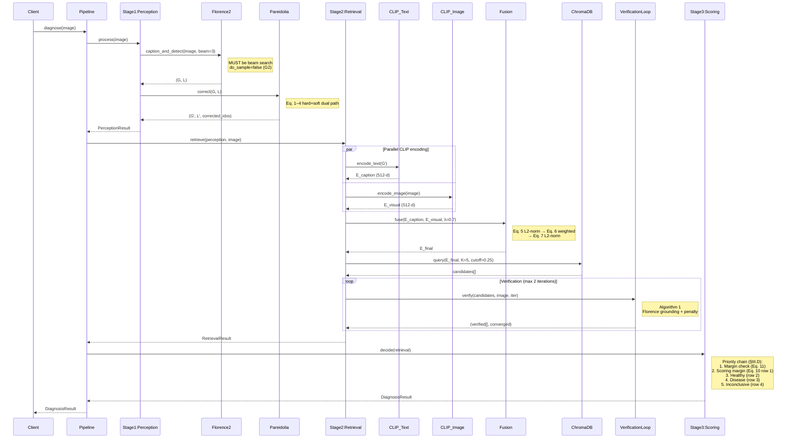

# fishdx — System Architecture (M0 Phase 1 Revised)


This document is the **authoritative architecture reference** for M0 Bootstrap. Every Phase 2–4 artifact must trace back to a contract defined here. Changes to this document require ADR.

---

## 1. Repository Skeleton

```
fishdx/
├── PROJECT_DIRECTION.md                       (253 lines — Compass)
├── README_fishdx.md                           (104 lines — Subproject README)
│
│
├── pyproject.toml                             [M0] single dependency truth
├── ruff.toml · mypy.ini · .pre-commit-config.yaml
├── .gitignore                                 (data/, *.pyc, .venv/)
│
├── configs/
│   ├── default.yaml                           [M0] Paper Table IX authority
│   ├── dataset.yaml                           [M0] D1–D9 paths
│   ├── kb.yaml                                [M0] KB doc metadata
│   ├── logging.yaml                           [M0] structured JSON
│   └── schema/frozen_config.lock              [M0] SHA256 integrity
│
├── src/fishdx/                                [M0 SKELETON ONLY — no impl]
│   ├── __init__.py
│   ├── config.py                              (Pydantic schema)
│   ├── errors.py                              (FishdxError hierarchy — see §2.3)
│   ├── pipeline.py                            (pipeline orchestrator)
│   ├── perception/ · retrieval/ · scoring/    (Stage packages)
│   ├── kb/ · metrics/ · data/ · utils/
│   └── py.typed                               (PEP 561 marker)
│
├── tests/
│   ├── conftest.py · unit/ · integration/ · reproducibility/
│
├── experiments/                               [deferred to M3–M4]
│
└── docs/
    ├── architecture.md                        (this file)
    ├── adr/0001-deterministic-pipeline.md
    ├── adr/0002-chromadb-hnsw-choice.md
    ├── adr/0003-pareidolia-dual-path.md
    ├── adr/0004-transformers-trust-remote-code.md
    ├── m0/dependency-risk.md                  (supply chain matrix)
    └── m0/smoke-test-spec.md                  (M0 acceptance)
```

---

## 2. Three-Stage Pipeline — Data Flow with Failure Modes

### 2.1 Happy Path + Error Flow

```
                        Input: image: Path
                                │
                   ┌────────────┴────────────┐
                   │ Gate: path exists & is  │
                   │ readable PIL-Image?     │
                   └────────────┬────────────┘
                    pass ┌──────┼──────┐ fail
                         ▼              ▼
    ┌────────────────────────────────┐  raise InputValidationError
    │ STAGE 1  Visual Perception     │  (hard failure — no recovery)
    │                                │
    │  Florence-2 caption_and_detect │
    │     ├─ OOM → StageError(hard)  │─────┐
    │     ├─ NaN logits → StageError │─────┤
    │     └─ timeout>10s → StageError│─────┤
    │                                │     │
    │  Pareidolia correct(G, L)      │     │
    │     ├─ empty G → soft: emit    │     │
    │     │    PerceptionResult with │     │
    │     │    warn="empty_caption"  │     │
    │     └─ all remapped → emit     │     │
    │          with structural_only  │     │
    └─────────────┬──────────────────┘     │
                  │                         │
                  ▼                         │
        PerceptionResult                    │
        (frozen, with warnings[])           │
                  │                         │
    ┌─────────────┴──────────────────┐     │
    │ STAGE 2  Knowledge Retrieval   │     │
    │                                │     │
    │  CLIP encode (parallelisable)  │     │
    │     ├─ text NaN → StageError   │─────┤
    │     └─ image NaN → StageError  │─────┤
    │                                │     │
    │  Fusion Eq.5–7                 │     │
    │     └─ zero-norm → StageError  │─────┤
    │                                │     │
    │  ChromaDB query Top-K=5        │     │
    │     ├─ empty result (cutoff    │     │
    │     │    too strict)           │     │
    │     │    → soft: emit empty    │     │
    │     │    RetrievalResult       │     │
    │     ├─ index not ready         │─────┤
    │     │    → StageError(hard)    │     │
    │     └─ < 2 results → margin    │     │
    │          undefined → handled   │     │
    │          in Stage 3            │     │
    │                                │     │
    │  Verification Loop             │     │
    │     ├─ max_iter=2 exhausted    │     │
    │     │    → soft: emit with     │     │
    │     │    converged=False       │     │
    │     └─ Florence grounding err  │     │
    │          → propagate as soft   │     │
    └─────────────┬──────────────────┘     │
                  │                         │
                  ▼                         │
        RetrievalResult                     │
        (frozen, with converged flag)       │
                  │                         │
    ┌─────────────┴──────────────────┐     │
    │ STAGE 3  Scoring Decision      │     │
    │                                │     │
    │  Priority 1: MarginGate        │     │
    │     ├─ < 2 retrievals →        │     │
    │     │    Inconclusive(         │     │
    │     │    reason="no_margin")   │     │
    │     └─ margin < θ_margin →     │     │
    │          Inconclusive(         │     │
    │          reason="low_margin")  │     │
    │                                │     │
    │  Priority 2–5: Eq.8–10 Scorer  │     │
    │     ├─ empty O → Inconclusive  │     │
    │     │    (reason="no_evidence")│     │
    │     └─ normal → Healthy /      │     │
    │          Disease(D_k) /        │     │
    │          Inconclusive          │     │
    └─────────────┬──────────────────┘     │
                  │                         │
                  ▼                         ▼
        DiagnosisResult          ┌──────────────────────┐
        (Healthy | Disease(D_k)  │ Circuit Breaker      │
         | Inconclusive(reason)) │ (hard stage errors)  │
                                 │                      │
                                 │ Wrap in              │
                                 │ PipelineError with   │
                                 │ stage, cause, trace  │
                                 └──────────────────────┘
                                          │
                                          ▼
                                    raise to caller
                                    (never return partial result)
```

### 2.2 Failure Mode Classification

| Mode | Severity | Behaviour | Example | Error Class |
|---|---|---|---|---|
| **Hard Stage Failure** | 🔴 | Circuit break; wrap in `PipelineError`; never return partial result | Florence-2 OOM, CLIP NaN, ChromaDB index missing | `StageError` subclasses |
| **Soft Stage Failure** | 🟡 | Continue pipeline; propagate `warnings[]` in result | empty caption, cutoff-filtered retrieval, verification not converged | (not an error — field on result) |
| **Deterministic Inconclusive** | 🟢 | First-class decision outcome (not an error) | margin < θ_margin, \|S_h - S_d\| ≤ m, no evidence | (not an error — `DiagnosisResult`) |
| **Input Validation** | 🔴 | Reject before Stage 1; no side effects | file missing, not an image, corrupted | `InputValidationError` |
| **Config Load / Freeze** | 🔴 | Fail at load-time before any inference | missing `florence2.revision`, frozen-config mutation attempt | `ConfigError` subclasses |
| **Reproducibility Invariant** | 🔴 | Fail at warmup or hot-path guard | seeds unset, CUDNN non-determinism flag off, revision branch-name | `ReproducibilityError` subclasses |

### 2.3 Error Hierarchy (to be implemented in `src/fishdx/errors.py`)

```
FishdxError                               (abstract base — all fishdx-raised errors)
├── InputValidationError                  (pre-Stage 1; invalid image file)
├── PipelineError                         (wraps hard stage failures from Pipeline orchestrator)
├── ConfigError                           (config validation / loading / freezing)
│   ├── ConfigSchemaError                 (pydantic ValidationError wrapper)
│   ├── ConfigFrozenMutationError         (attempt to mutate after freeze)
│   ├── ConfigMissingFieldError           (required field absent)
│   └── ConfigFileError                   (YAML parse / file not found)
├── ReproducibilityError                  (seed / determinism invariant violated at runtime)
│   ├── SeedNotSetError                   (global seeds not configured before inference)
│   ├── NonDeterministicAlgorithmError    (CUDNN non-determinism flag regression;
│   │                                      torch.use_deterministic_algorithms=False detected)
│   ├── RevisionPinError                  (model revision not pinned to SHA; branch name detected)
│   └── ConfigHashDriftError              (frozen config hash differs from previous run
│                                          without explicit re-freeze signal)
└── StageError                            (hard failure within a Stage)
    ├── PerceptionError
    │   ├── Florence2InferenceError
    │   └── PareidoliaCorrectionError
    ├── RetrievalError
    │   ├── ClipEncodingError
    │   ├── FusionNormalizationError
    │   ├── ChromaStoreError
    │   └── VerificationError
    └── ScoringError                      (Eq.8–11 invariant violation)
```

**Class-level contract**: Every `FishdxError` subclass carries a structured `.context: dict[str, Any]` attribute capturing (stage, cause, trace_id, config_hash) for observability span emission.

**ConfigError — Trigger Conditions**:
- `ConfigSchemaError`: raised by `src/fishdx/config.py` when Pydantic validation fails on `load_config()`; e.g., `λ*` outside `[0, 1]`, `τ` negative, `num_beams < 1`
- `ConfigFrozenMutationError`: raised when any code attempts attribute assignment on a frozen `AppConfig` after `freeze_hash()` has been computed
- `ConfigMissingFieldError`: raised when `configs/default.yaml` lacks a required field (e.g., `florence2.revision` absent per ADR-0004)
- `ConfigFileError`: raised on YAML parse failure, missing file, or `yaml.load()` invoked without `SafeLoader` (S8 anti-pattern enforcement)

**ReproducibilityError — Trigger Conditions**:
- `SeedNotSetError`: raised at first `Pipeline.diagnose()` call if `numpy`, `torch`, or `random` seeds were not set via `fishdx.utils.seeding.set_global_seed(42)` during warmup
- `NonDeterministicAlgorithmError`: raised at warmup if `torch.backends.cudnn.deterministic` is False, or `torch.use_deterministic_algorithms(True)` has been toggled off, or a non-deterministic op is invoked in the hot path
- `RevisionPinError`: raised by `Florence2Wrapper.__init__` if `config.florence2.revision` matches a branch-name pattern (`main`, `master`, `dev`, semver tags) rather than a 40-char SHA (enforces ADR-0004 M1)
- `ConfigHashDriftError`: raised by `tests/reproducibility/` if the observed `config.freeze_hash()` differs from the hash recorded in the previous regression run without an explicit `--allow-config-drift` flag

**Positioning rationale**: `ConfigError` and `ReproducibilityError` are siblings of `StageError` because they originate outside any specific Stage — config errors occur at load/freeze time (pre-warmup), reproducibility errors occur at warmup or cross-cutting invariant checks. Making them siblings of `StageError` (rather than nesting under `PipelineError`) preserves clean exception matching: `except StageError` catches only Stage 1/2/3 hard failures without accidentally swallowing config or determinism violations.

Soft failures are NOT errors — they are fields on `XxxResult` dataclasses.

---

## 3. Sequence Diagram — Temporal Contract

Demonstrates ordering constraints missing from the DFD: what runs in parallel, what must serialize.



**Key contracts**:
- CLIP text/image encoding is the **only parallelizable region** in the hot path
- ChromaDB query → VerificationLoop must serialize (verify depends on query results)
- Verification is a fixed-bound loop (max_iter=2); no unbounded recursion

---

## 4. Interface Signatures — Full Protocol Contracts

### 4.1 Stage Protocols (with determinism & thread-safety contracts)

```python
# src/fishdx/perception/__init__.py (Protocol — no impl in M0)
from typing import Protocol
from pathlib import Path

class PerceptionStage(Protocol):
    """Pure deterministic Stage 1 of the pipeline.

    Determinism Contract (S6 §3.3):
        For fixed (config, seed, image_bytes), ``process()`` MUST return a
        bit-identical ``PerceptionResult`` across invocations. This is
        validated by ``tests/reproducibility/test_seed_determinism.py``.

    Thread Safety:
        - Instance methods are thread-safe for read-only inference after
          ``warmup()`` has completed.
        - Model loading (implicit on first call, explicit via ``warmup()``)
          is NOT thread-safe. Call ``warmup()`` before multi-threaded use.

    Failure Modes:
        - Hard: raises ``PerceptionError`` (subclass of ``StageError``).
        - Soft: returns ``PerceptionResult`` with ``warnings`` field populated.
        - Input invalid: raises ``InputValidationError`` before any compute.

    References:
        Paper §III.B "Visual Perception and Pareidolia Correction"
        Skill S2 perception-stage
    """

    def process(self, image: Path) -> PerceptionResult: ...

    def warmup(self) -> None:
        """Force eager model load. Safe to call multiple times; idempotent."""

    def health_check(self) -> HealthStatus:
        """Return component-level readiness: Florence-2 loaded, CLIP loaded,
        keyword sets populated, centroid cache fresh."""


class RetrievalStage(Protocol):
    """Pure deterministic Stage 2.

    Determinism Contract:
        Deterministic conditional on (config, seed, PerceptionResult, image).
        HNSW index determinism requires: same build order + same seed +
        efConstruction fixed. See ADR-0002 §Consequences.

    Thread Safety:
        - Read (query) is thread-safe.
        - Write (index build) requires external lock; NOT called in hot path.
    """

    def retrieve(self, percept: PerceptionResult, image: Path) -> RetrievalResult: ...
    def warmup(self) -> None: ...
    def health_check(self) -> HealthStatus: ...


class ScoringStage(Protocol):
    """Pure deterministic Stage 3. Rule-based; no ML inference.

    Determinism Contract:
        Fully deterministic by construction (no RNG, no model inference).
        Identical inputs → identical outputs always.

    Thread Safety:
        Fully thread-safe (no mutable state).
    """

    def decide(self, retrieval: RetrievalResult) -> DiagnosisResult: ...
```

### 4.2 Result Dataclasses (frozen, Pydantic)

```python
# src/fishdx/perception/types.py
from pydantic import BaseModel, ConfigDict, Field
from pathlib import Path

class PerceptionResult(BaseModel):
    """Output of Stage 1. Frozen; passed downstream by value."""
    model_config = ConfigDict(frozen=True, strict=True)

    image_path: Path
    caption_raw: str                 # G
    caption_corrected: str           # G' (after Eq. 4 remap)
    objects_raw: list[DetectedObject]  # L
    objects_corrected: list[DetectedObject]  # L'
    pareidolia_corrections: list[PareidoliaEvent]
    warnings: list[str] = Field(default_factory=list)
    compute_time_ms: float


class RetrievalResult(BaseModel):
    model_config = ConfigDict(frozen=True, strict=True)

    e_final: list[float]             # 512-d L2-normalized
    candidates_raw: list[RetrievedDoc]
    candidates_verified: list[RetrievedDoc]
    verification_converged: bool
    verification_iterations: int
    margin_top1_top2: float          # Eq. 11
    warnings: list[str] = Field(default_factory=list)
    compute_time_ms: float


class DiagnosisResult(BaseModel):
    model_config = ConfigDict(frozen=True, strict=True)

    decision: Literal["Healthy", "Disease", "Inconclusive"]
    disease_class: str | None        # populated only when decision == "Disease"
    score_healthy: float             # S_h
    score_disease: float             # S_d
    retrieval_margin: float
    inconclusive_reason: str | None  # "low_margin" | "scoring_margin" | "no_evidence"
    evidence: list[str]              # human-readable trace
    warnings: list[str] = Field(default_factory=list)
```

### 4.3 Orchestrator Signature

```python
# src/fishdx/pipeline.py
class Pipeline:
    """End-to-end deterministic diagnostic pipeline.

    Lifecycle:
        __init__(config) → warmup() → [diagnose(image)]* → close()

    Thread Safety:
        After warmup(), ``diagnose()`` is thread-safe for read-only serving.
        Do NOT share across processes without config re-freeze.
    """

    def __init__(self, config: AppConfig) -> None: ...
    def warmup(self) -> None: ...
    def health_check(self) -> HealthStatus: ...
    def diagnose(self, image_path: Path) -> DiagnosisResult: ...
    def close(self) -> None: ...
```

### 4.4 Config Schema Root

```python
# src/fishdx/config.py
class AppConfig(BaseModel):
    model_config = ConfigDict(frozen=True, strict=True, extra="forbid")

    meta: MetaConfig
    florence2: Florence2Config
    clip: ClipConfig
    pareidolia: PareidoliaConfig
    fusion: FusionConfig          # λ* = 0.7 (Eq. 6)
    retrieval: RetrievalConfig    # Top-K=5, cutoff=0.25 (primary Config B; legacy A=0.5)
    verification: VerificationConfig  # θ=0.5, penalty=0.5, max_iter=2
    scoring: ScoringConfig        # w_d={3,2,1}, w_h={2,1}
    decision: DecisionConfig      # T_h=2, m=1
    margin: MarginConfig          # θ_margin=0.02
    kb: KBConfig
    statistics: StatisticsConfig

    def freeze_hash(self) -> str:
        """SHA256 of the canonical config dict; written to
        configs/schema/frozen_config.lock on first successful load."""
```

---

## 5. Phase-Gate Progression (Revised)

| Phase | Artifact | Status |
|---|---|---|
| **Phase 1** | Skeleton + DFD + failure modes + sequence diagram + 4 ADRs + test matrix + risk matrix + smoke spec | ✅ Produced in revised M0 |
| **Phase 2** | Test stubs (RED) — 61+ parametrized cases per `docs/m0/test-matrix.md` | ✓ delivered in this release |
| **Phase 3** | Config + Pydantic + bootstrap infra (no Stage impl — deferred to M2) | ✓ delivered in this release |
| **Phase 4** | M0 smoke tests green | ⏸ After Phase 3 |

---

## 6. Cross-References

| Topic | See |
|---|---|
| ChromaDB HNSW choice & determinism caveat | `docs/adr/0002-chromadb-hnsw-choice.md` |
| Pareidolia dual-path justification | `docs/adr/0003-pareidolia-dual-path.md` |
| Florence-2 `trust_remote_code` security exception | `docs/adr/0004-transformers-trust-remote-code.md` |
| Equation test coverage matrix | `docs/m0/test-matrix.md` |
| Dependency supply-chain risk | `docs/m0/dependency-risk.md` |
| M0 acceptance smoke tests | `docs/m0/smoke-test-spec.md` |

---

**End of architecture.md**
